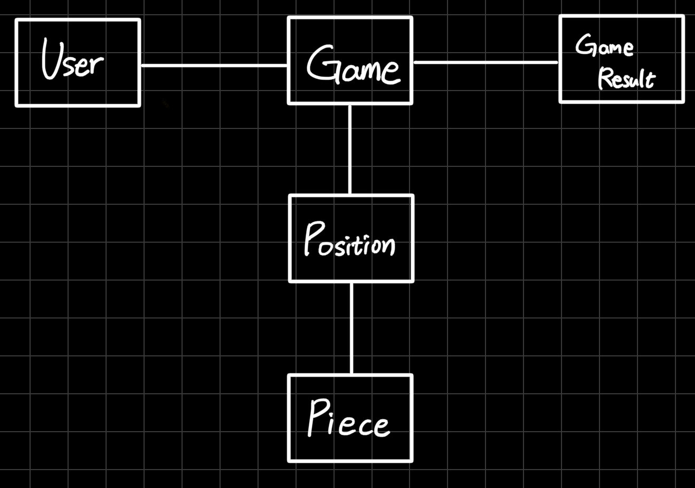

# 스프링 보드게임
Java 연습, 객체 지향 개발 연습, Spring 기초 연습을 위해 제작한 토이 프로젝트입니다.  
체스만 구현하였지만 장기 등 2인용 기물 게임에 대한 확장성을 고려하여 설계하였습니다.

로그인, 로그아웃 혹은 매칭 기능은 없으며 단순히 메모리 안에서 체스판을 구성하고 이동시키는 어플리케이션입니다.

stand-alone 버전은 다음 Repository 를 참고해주세요.

[https://github.com/Koowin/application-java-chess](https://github.com/Koowin/application-java-chess)

# 객체 지향 개발

'객체지향의 사실과 오해' 라는 책을 읽고 객체와의 메시지에 따라 도메인을 설계하였습니다.

사용자가 선택할 수 있는 큰 Use case 는 다음과 같습니다.

1. 새로운 게임을 시작하라.
2. "특정 위치" 에 무슨 기물이 있는가?
3. "특정 위치" 에 있는 기물의 이동 가능한 칸의 목록은 무엇인가?
4. "A 위치" 에서 "B 위치" 로 기물을 이동하라.
5. 현재 누구의 차례인가?
6. 게임 결과는 무엇인가?


# 인터페이스 설계



## Game

```java
public interface Game {
    /**
     * 게임을 시작한다
     */
    void startNewGame();

    /**
     * 위치에 있는 기물을 확인한다
     *
     * @param position 확인하고자 하는 위치
     * @return 해당 위치의 기물
     */
    Optional<Piece> peek(String position);

    /**
     * 현재 위치에서 기물이 움직일 수 있는 다음 위치들을 확인한다.
     *
     * @param position 확인하고자 하는 위치
     * @return 움직일 수 있는 위치들의 목록
     */
    List<Position> movablePosition(String position);

    /**
     * 현재 위치에서 다음 위치로 기물을 이동한다.
     *
     * @param from 현재 위치
     * @param to 다음 위치
     * @return 성공 여부
     */
    boolean move(String from, String to);

    /**
     * 현재 차례를 확인한다.
     * @return
     */
    String whoseTurn();

    /**
     * 게임 종료 결과를 확인한다.
     * @return 종료 결과
     */
    GameResult gameResult();
}
```


## Position

```java
public interface Position {
    /**
     * 현재 칸의 기물을 확인한다
     * 
     * @return 현재 칸의 기물
     */
    Optional<Piece> peek();

    /**
     * 새로운 기물을 현재 칸에 놓는다
     * 
     * @param nextPiece 현재 칸에 놓을 새로운 기물
     * @return 기존 기물
     */
    Optional<Piece> setPiece(Optional<Piece> nextPiece);

    /**
     * 현재 칸의 행을 구한다
     * 
     * @return 현재 칸의 행
     */
    int getRow();

    /**
     * 현재 칸의 열을 구한다
     * 
     * @return 현재 칸의 열
     */
    int getColumn();
}
```


## Piece

```java
public interface Piece {
    /**
     * 기물의 현재 위치와 판 정보를 입력으로 받아 이동 가능한 위치들을 계산한다
     *
     * @param from 기물의 현재 위치
     * @param board (판 정보)모든 위치의 정보
     * @return 이동 가능한 위치 리스트
     */
    List<Position> movablePosition(Position from, Position[][] board);

    /**
     * 기물이 현재 위치에서 다음 위치로 이동 가능한지 확인한다.
     *
     * @param from 기물의 현재 위치
     * @param to 기물의 다음 위치
     * @param board (판 정보)모든 위치의 정보
     * @return 이동 가능 여부
     */
    boolean canMove(Position from, Position to, Position[][] board);

    /**
     * 기물의 진영 정보를 확인한다.
     *
     * @return 기물의 진영
     */
    boolean side();

    /**
     * 기물이 왕인지 확인한다. (게임 종료 여부를 결정짓기 위해 사용)
     *
     * @return 기물이 왕인지 여부
     */
    boolean isKing();
}
```


# API

```java
@PostMapping("/game")
void newGame(@RequestBody String gameType);

@PostMapping("/game/peek")
@ResponseBody
Optional<Piece> peek(@RequestBody String position);

@PostMapping("game/movable")
@ResponseBody
List<String> movable(@RequestBody String position);

@PostMapping("game/move")
@ResponseBody
boolean move(@RequestBody String from, String to);

@GetMapping("game/turn")
@ResponseBody
String whoseTurn();

@GetMapping("game/result")
@ResponseBody
GameResult result();
```

